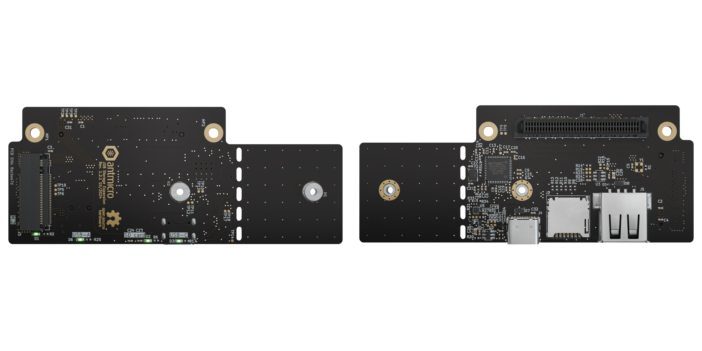

# Jetson Orin Baseboard Storage Expansion Board

Copyright (c) 2023 [Antmicro](https://www.antmicro.com)

## Overview

This project contains open hardware design files for an expansion board compatible with Antmicro's [Jetson Orin Baseboard](https://github.com/antmicro/jetson-orin-baseboard).
The expansion board includes a MicroSD card slot and an M.2 (key-M) slot intended for connecting additional storage solutions to the Jetson Orin Baseboard.
The M.2 slot supports 2280 and 2242 M.2 NVMe discs. 
The design files were prepared in KiCad 7.x.

## Key features

* Jetson Orin Baseboard expansion connector
* Support for 2280 and 2242 disc sizes
* M.2 key M
* MicroSD card reader with USB 2.0 interface

## Project structure 

The main directory contains KiCad PCB project files, a LICENSE and a README.
The remaining files are stored in the following directories: 

* `lib` - contains the component libraries 
* `img` - contains graphics for this README
* `assets` - contains visual assets for showcasing this design on [Open Hardware Portal](https://openhardware.antmicro.com).

## Licensing

This project is published under the [Apache-2.0](LICENSE) license.

